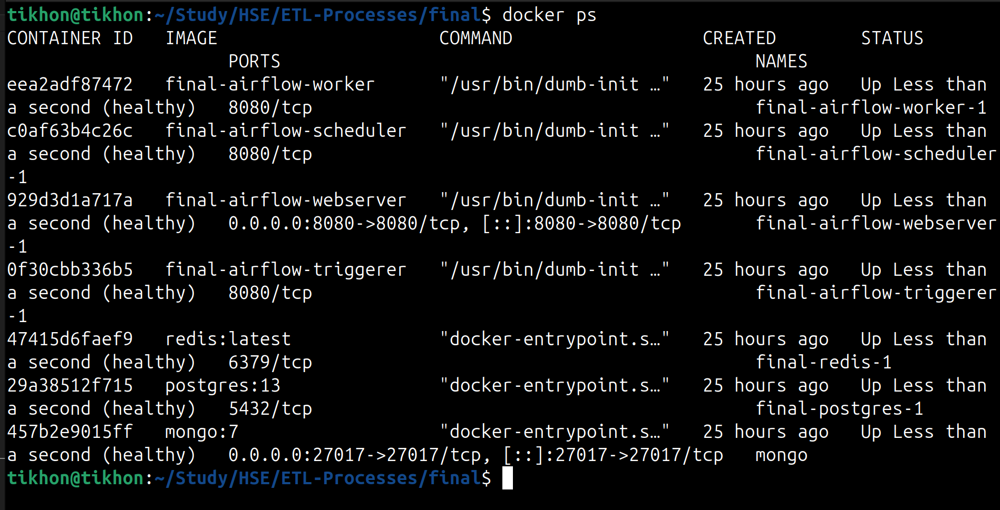
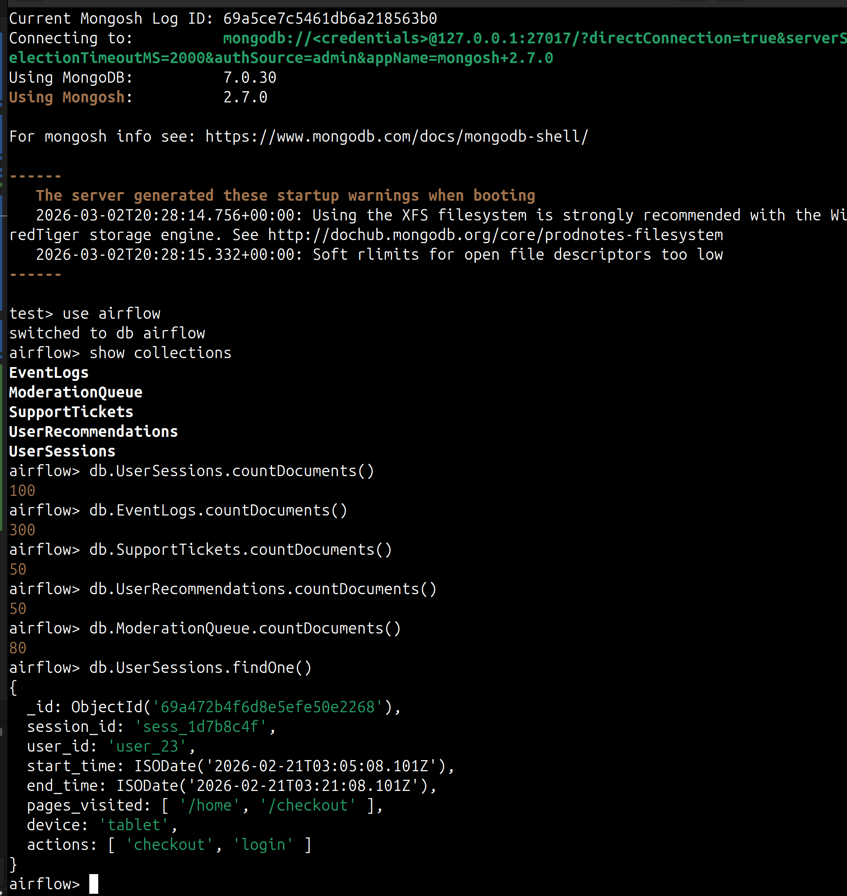
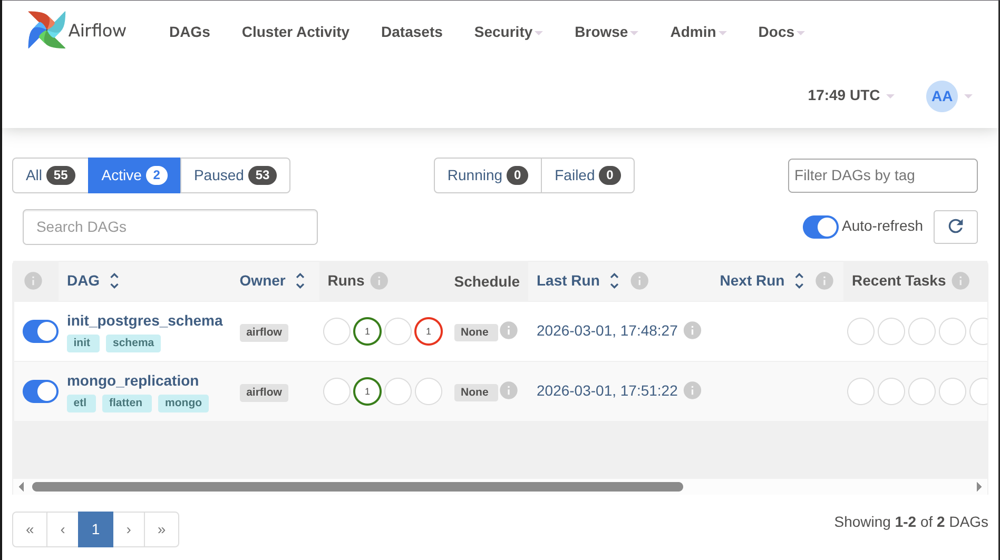
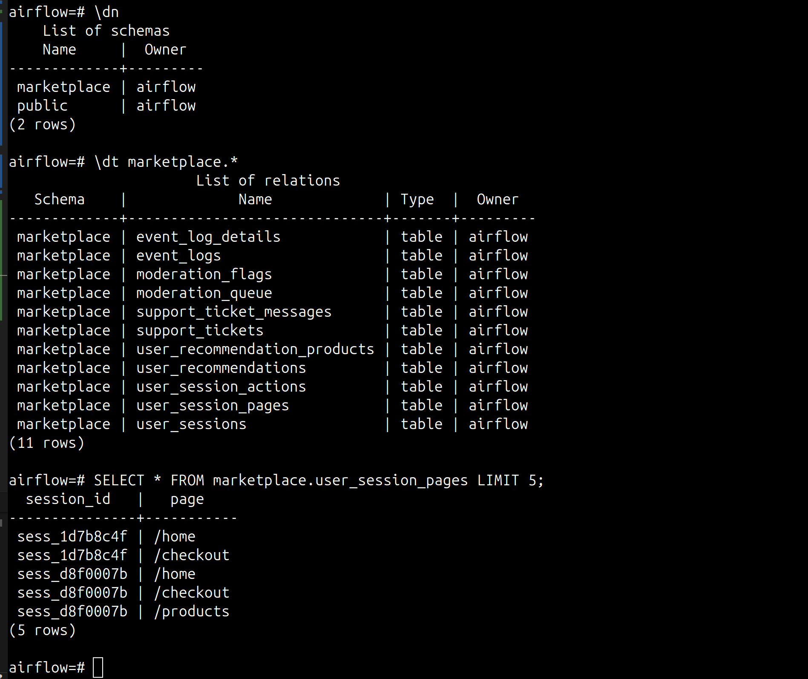

# ETL Processes final task

Проект реализует репликацию операционных данных из
**MongoDB** в **PostgreSQL** с
использованием **Apache Airflow**.

------------------------------------------------------------------------

## Архитектура

MongoDB \
↓\
Airflow \
↓\
PostgreSQL

MongoDB используется как источник сырых операционных данных.\
PostgreSQL хранит распрямлённые данные в схеме
`marketplace`.

------------------------------------------------------------------------

# 1. Запуск проекта

``` bash
docker compose up --build
```

1.  Запустить `init_postgres_schema`\
2.  Запустить `full_mongo_replication`\
3.  Проверить данные в PostgreSQL



------------------------------------------------------------------------

# 2. Генерация тестовых данных в MongoDB

```bash
docker compose exec airflow-worker python /opt/airflow/scripts/generate_data_for_mongodb.py
```

Скрипт создаёт и заполняет следующие коллекции:

-   `UserSessions`
-   `EventLogs`
-   `SupportTickets`
-   `UserRecommendations`
-   `ModerationQueue`

------------------------------------------------------------------------

# 3. Проверка данных в MongoDB

## Подключение

```bash
docker compose exec mongo mongosh -u airflow -p airflow --authenticationDatabase admin
```

После подключения:

```javascript
use airflow
show collections

db.UserSessions.countDocuments()
db.EventLogs.countDocuments()
db.SupportTickets.countDocuments()
db.UserRecommendations.countDocuments()
db.ModerationQueue.countDocuments()
```

Пример просмотра документа:

```javascript
db.UserSessions.findOne()
```



------------------------------------------------------------------------

# 4. Репликация данных

Репликация выполняется DAG `mongo_replication`.

Этапы процесса:

1.  Extract данных из MongoDB\
2.  Распрямление вложенных структур и массивов\
3.  Batch insert в PostgreSQL \

Перед первым запуском необходимо выполнить DAG:

-   `init_postgres_schema`

Затем:

-   `mongo_replication`



------------------------------------------------------------------------

# 5. Проверка данных в PostgreSQL

## Подключение

```bash
docker exec -it final-postgres-1 psql -U airflow -d airflow
```

## Проверка схемы

``` sql
\dn
```

Должна присутствовать схема `marketplace`

## Проверка таблиц

``` sql
\dt marketplace.*
```

Ожидаемые таблицы:

-   user_sessions
-   user_session_pages
-   user_session_actions
-   event_logs
-   event_log_details
-   support_tickets
-   support_ticket_messages
-   user_recommendations
-   user_recommendation_products
-   moderation_queue
-   moderation_flags

## Проверка количества строк

``` sql
SELECT COUNT(*) FROM marketplace.user_sessions;
SELECT COUNT(*) FROM marketplace.user_session_pages;
SELECT COUNT(*) FROM marketplace.user_session_actions;
SELECT COUNT(*) FROM marketplace.event_logs;
SELECT COUNT(*) FROM marketplace.support_tickets;
```



------------------------------------------------------------------------
